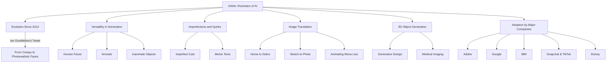

### Real World GANs
---

GANs, short for Generative Adversarial Networks, are like the rockstars of the AI world right now. They've only been around since 2014, but the leaps and bounds they've made are nothing short of amazing. You've probably seen some uncannily realistic human faces generated by GANs. If not, you're missing out; these things can fool you into thinking they're photographs of real people.

Remember those creepy, inhuman faces GANs produced back in 2014? Well, fast forward to today, and we've got images that are not just photorealistic but also high-res. The evolution is so rapid that Ian Goodfellow himself couldn't help but tweet about it. And it's not just human faces. GANs are versatile. They can produce anything from realistic animals to inanimate objects.

<blockquote class="twitter-tweet">
4.5 years of GAN progress on face generation. <a href="https://t.co/kiQkuYULMC">https://t.co/kiQkuYULMC</a> <a href="https://t.co/S4aBsU536b">https://t.co/S4aBsU536b</a> <a href="https://t.co/8di6K6BxVC">https://t.co/8di6K6BxVC</a> <a href="https://t.co/UEFhewds2M">https://t.co/UEFhewds2M</a> <a href="https://t.co/s6hKQz9gLz">https://t.co/s6hKQz9gLz</a> <a href="https://t.co/F9Dkcfrq8l">pic.twitter.com/F9Dkcfrq8l</a>
&mdash; Ian Goodfellow (@goodfellow_ian) <a href="https://twitter.com/goodfellow_ian/status/1084973596236144640?ref_src=twsrc%5Etfw">January 15, 2019</a></blockquote> 

But let's talk imperfections. While GANs can generate near-perfect images, they also have their quirky moments. Sometimes you'll get a cat that looks like it came from another dimension. But hey, that's the beauty of machine learning, right? It learns from the data it's fed, and sometimes that data includes meme texts on cat photos. So, don't be surprised if your generated cat meme has some gibberish text on it.

Image translation is another forte of GANs. Imagine converting a horse into a zebra in a photograph, or turning rough sketches into photorealistic scenes. Yes, GANs can do that. They can even bring the Mona Lisa to life, Hogwarts-style. Forget 2D, these networks have stepped into the 3D realm, generating objects like furniture. So whether you're into generative design or medical imaging, GANs have something for you.

Big names like Adobe, Google, and IBM are already harnessing the power of GANs for various applications—from next-gen Photoshop features to data augmentation. Social media platforms like Snapchat and TikTok are spicing up their filter game with GANs. Even Disney's in the mix, using GANs for super-resolution techniques.

To sum it up, GANs are on fire right now. From their rapid advancements to their adoption by major companies, these models are widening the horizons of what's possible in machine learning. And guess what? By the end of this course, you'll be able to wield this 'magic wand' for your own projects. Get excited, because the possibilities are endless.

