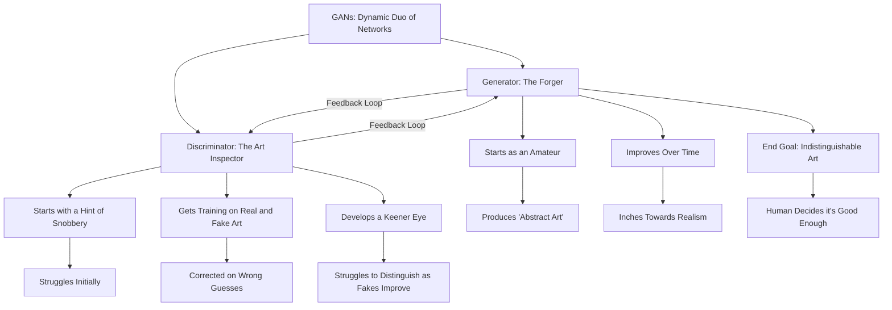

### Intution Behind GANs

GANs, standing for Generative Adversarial Networks, are this dynamic duo of neural networks—the generator and the discriminator. Think of them as a forger and an art inspector locked in this endless game of cat and mouse. The generator starts off as an amateur, like a dog trying to paint, completely clueless about what a 'real' painting looks like. The discriminator, on the other hand, starts with a beret and a hint of snobbery, sorting through a pile of real and fake paintings, trying to figure out which is which.

In the beginning, both are fairly naive. The generator produces what can only be called 'abstract art,' while the discriminator struggles to separate the masterpieces from the doodles. But here's the catch—the discriminator gets to see the real deal, the actual artwork, while the generator is kept in the dark. It's like asking someone to forge a Mona Lisa without ever having seen it.

The game kicks off with some basic training for the discriminator. It gets to see a mix of real and fake art and is corrected when it guesses wrong. It's like teaching a dog new tricks; each round makes it better at sniffing out the fakes. The generator, in turn, takes these critiques to improve its own art. It doesn't get it right immediately but starts inching towards something more realistic.

Over time, this dynamic changes. The generator starts producing art that's actually hard to distinguish from the real thing. It's like the dog has suddenly started painting Mona Lisas. The discriminator has to up its game, developing a keener eye for detail as the fakes get better and better. And the cycle continues until you, the human, decide that the generator's work is indistinguishable from real art.

To sum it up, it's a competitive feedback loop. The generator aims to produce art so good that it fools the discriminator, while the discriminator strives to get better at catching the fakes. They both learn from each other, and the game only ends when you're satisfied with the generator's skill level. Next up, we'll dig deeper into how this fascinating competition unfolds.

