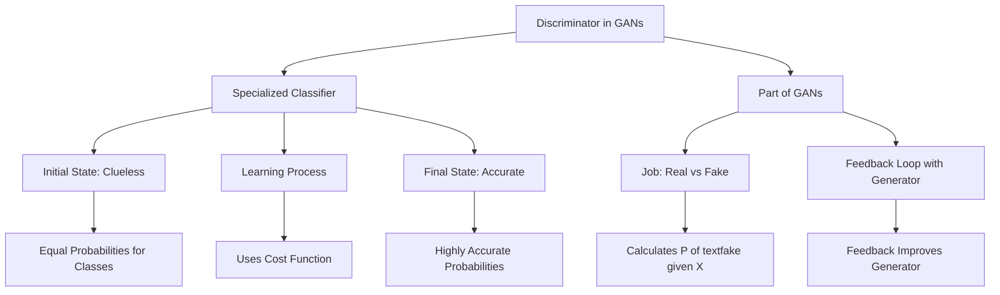

### Discriminator

The discriminator in GANs is basically a specialized classifier. So, what's a classifier? Think of it as the guy who tells you whether the animal in a photo is a cat, a dog, or something else. It takes in features, like whether the animal purrs or plays with yarn, and gives you probabilities for each class. Early on, it's pretty clueless—equally likely to say cat or dog for a cat picture. But it learns over time to get these probabilities right.

So how does learning happen? Through a cost function. You feed the neural network features $\( X \)$ and labels $\( Y \)$, and it makes predictions $\( \hat{Y} \)$. The aim is to minimize the difference between $\( Y \)$ and $\( \hat{Y} \)$. The network adjusts its internal parameters, called $\( \theta \)$, in the direction that reduces this difference. It's like tuning a guitar; you tweak until the notes sound just right.

Now, let's pivot to GANs. In GANs, the discriminator is that classifier, but its job is a bit specific. It looks at an example—could be a real painting or a forgery—and decides how real it is. In terms of probabilities, it's gauging $\( P(\text{fake} | X) \)$, where $\( X \)$ are the features of the example. If it thinks an image is 85% fake, that's valuable feedback for the generator to improve its game.

In summary, the discriminator is doing double duty. It's a classifier that's been trained to sniff out what's real and what's not, and its feedback is crucial for the generator's training. 

