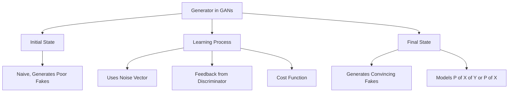

### Generator

Let's talk about the generator in a GAN, the real star of the show. You want this guy to be top-notch by the end of your training. The generator's job is to create fake stuff that looks real. Say you're training it on cats; it should spit out images that could fool anyone into thinking they're looking at a real cat.

So how does it avoid making the same cat over and over? It uses something called a 'noise vector.' This is a bunch of random numbers that get tossed into the generator's neural network along with the class you're aiming for (like cats). This ensures that every output is a unique, yet plausible, cat.

The generator starts off pretty naive but gets better over time. Here's how: It uses feedback from the discriminator, which tells it how close its fake stuff is to being believable. This feedback is captured in a 'cost function,' which basically tells the generator how good or bad it's doing. The generator then tweaks its internal settings to produce better fakes.

Now, onto some math. The generator is essentially trying to model $\( P(X|Y) \)$, the probability of features $\( X \)$ given a class $\( Y \)$. But if you're only dealing with one class, like cats, it's just $\( P(X) \)$. The aim is to mirror the real-world distribution of cats, so common cats are generated more often, and rare ones less so.

Alright, that's the generator in a nutshell. It starts off clueless, but with feedback from the discriminator, it gets better at its job, which is to produce convincing fakes. It's the heart of the GAN, and you want it beating strong.

