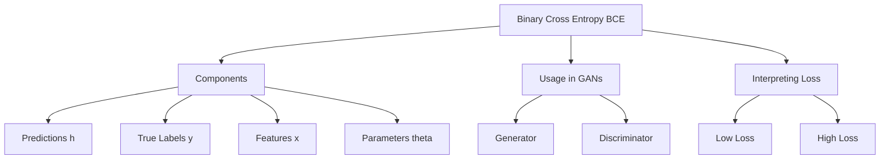

### Binary Cross Entropy

So you've probably heard of Binary Cross Entropy (BCE) if you're into GANs. Let's strip away the math jargon and get to why it's a big deal. BCE is like the referee in a game between the generator and the discriminator in a GAN. It tells you how good or bad a prediction is when the options are just real or fake.

The BCE formula might look like Greek to you at first, but it's really not that bad. You've got $\( h \)$, which represents the prediction your model (usually the discriminator) makes. $\( y \)$ is the true label—think 1 for real and 0 for fake. $\( x \)$ are the features, like the pixels in an image, and $\( \theta \)$ are the parameters that tweak the model's prediction. 

Now, the formula has two main parts. The first part kicks in when the true label $\( y \)$ is 1 (real). It checks how close the prediction $\( h \)$ is to 1. If it's close, the loss is low; if not, the loss skyrockets. The second part is for when $\( y \)$ is 0 (fake). Again, if $\( h \)$ is close to 0, you're good; otherwise, you're in trouble. 

Why the negative signs in the formula? Well, the math behind it ensures that the loss is always a positive number. We want a high loss to signify a bad prediction, and the model aims to lower this number during training. 

In a nutshell, BCE zeroes in on the 'realness' or 'fakeness' of what the generator produces and gives a score. The model aims to get this score as low as possible. The lower the BCE loss, the better your GAN is at fooling the discriminator. 

And yeah, you're not just doing this for one image. You do it for a bunch, like a mini-batch of 5 or so, and take the average. Each image in the batch could be different, so this average gives you a solid idea of how well your GAN is doing overall. 

